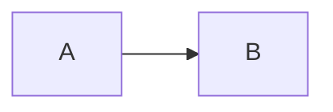

<!-- Fichier TÉMOIN volontairement cassé : chaque section viole une règle
     précise du linter. La sortie attendue est figée dans
     tests/lint/sortie-attendue.txt — si une règle régresse, le snapshot
     diverge. Ce commentaire déclenche lui-même la règle « commentaire de
     gabarit résiduel ». NE PAS CORRIGER CE FICHIER. -->

# ADR-0009 — Témoin volontairement cassé

## 1. Carte d'identité

| Champ              | Valeur |
|--------------------|--------|
| ID                 | ADR-0002 |
| Statut             | Accepté |
| Date de décision   | 2026-13-45 |
| Validé par         | — |
| Équipe / périmètre | — |
| Mots-clés          | témoin |
| Remplace           | — |
| Remplacé par       | ADR-9999 |

## 2. Résumé de la décision

> Nous avons choisi divers trucs. Et aussi d'autres choses.

## Références

## 3. Contexte et problème

[À remplir]

Comme mentionné plus haut, le choix découle du schéma ci-dessus.

## 5. Conséquences

### Positives

TODO

## 4. Décision
